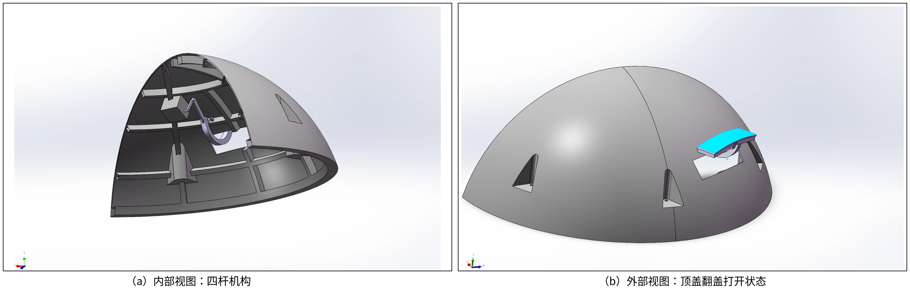
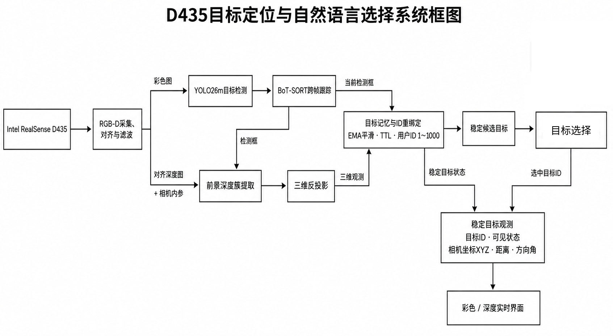
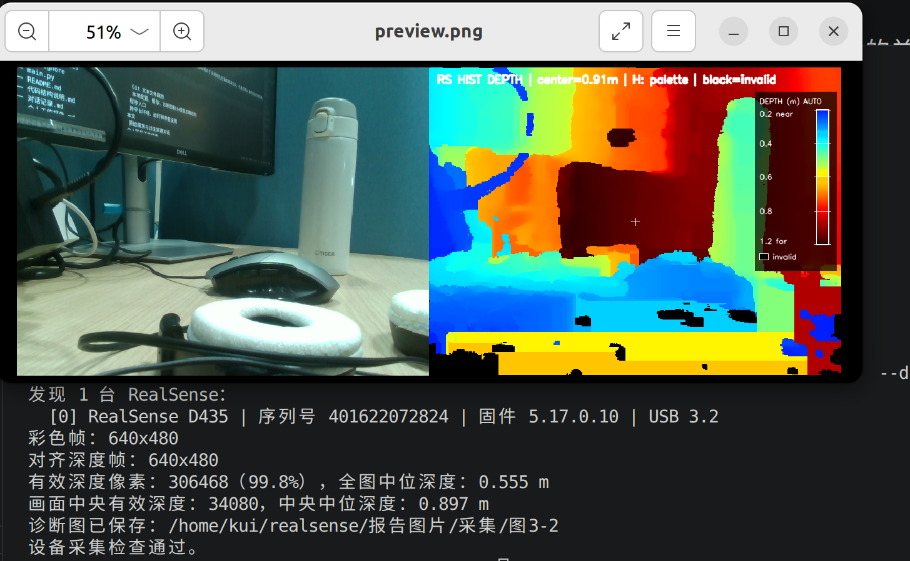
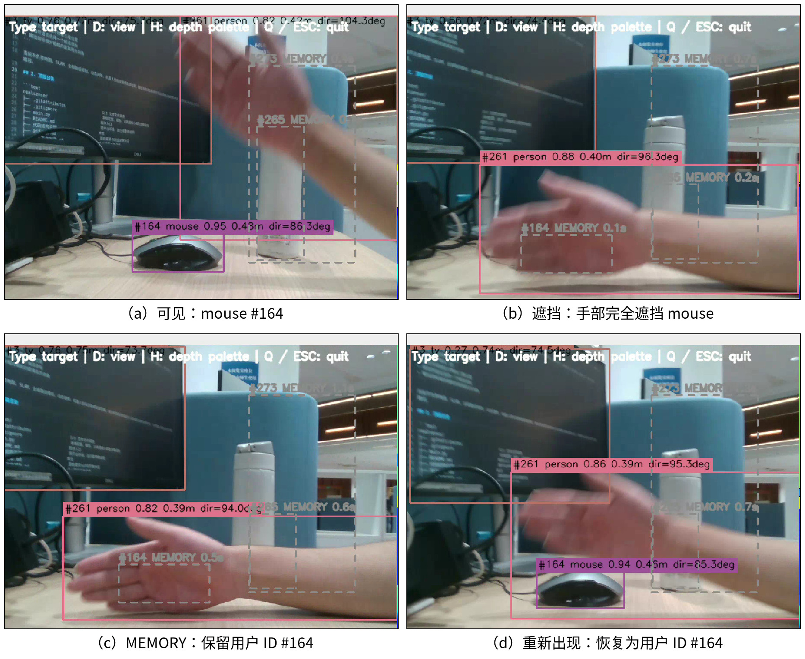
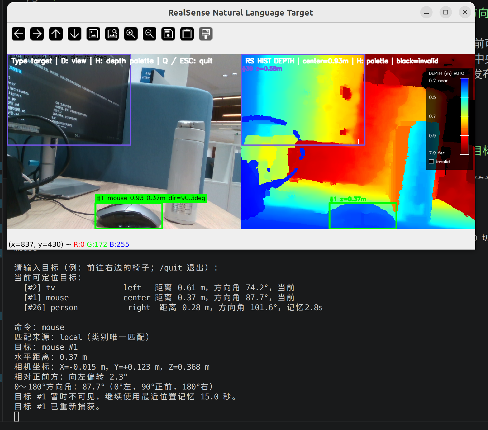

# 球形六足机器人视觉感知与相机机构个人工作报告

## 一、视觉方案调研

项目已有的PPO行走控制、摔倒恢复控制和行走—滚动—恢复联合仿真，主要解决机器人在复杂地形中如何保持稳定运动；要进一步用于探测任务，还需要知道周围有什么、目标在哪里以及前方环境是否允许通行。因此，我的视觉调研先是围绕不同运动形态下视觉是否可用展开。第一种思路是在球形滚动时放弃视觉，只在机器人展开或静止后采用常规相机。这一路线容易与已有六足行走控制结合，但滚动过程不可观测，无法连续掌握运动状态。第二种思路是保留球形态视觉，参考BallCam的旋转相机动态视图合成，通过旋转周期、图像配准和拼接获得相对稳定的视图。PPT内嵌视频也直观展示了高速旋转画面由杂乱视角逐渐合成为可观察场景的效果，但该路线对成像质量、转速规律、曝光和实时算力较敏感。

此后，我进一步把调研范围扩展到全景/鱼眼相机，希望利用广角减轻机器人滚动时视线快速变化和目标频繁出画的问题。其中，我重点了解了影石全景相机的成像方式、机身尺寸、接口形式以及桌面端Camera SDK、Media SDK的功能边界，并结合机器人有限的内部空间，检查相机拆机安装、视频流获取、图像拼接、畸变校正和后续二次开发的可行性。但是单目无法提供深度，所以放弃考虑。

与此同时，我还考察了Intel RealSense T265，并从传感器组成、输出数据等方面判断它的能力。T265集成双鱼眼相机、IMU和片上视觉计算单元，可以直接输出六自由度位姿，并具备视觉惯性里程计、建图和重定位能力，因而很适合估计机器人在行走、转向或短时滚动过程中的自身运动。也找到视频显示了设备在RealSense Viewer中输出实时运动轨迹的效果，说明它能够为控制系统提供连贯的位姿信息。不过，在进一步了解机器人现有硬件后，我发现整机已经自带IMU，能够提供姿态等运动信息，当前阶段没有必要再增加带有IMU的设备。同时，T265只配备的是两个单色灰度的鱼眼镜，无法提供彩色图像与准确深度信息，不能用来识别。此外，该产品也已停产。综上，并未选择T265。

在参观实验室并了解现有设备后，我们与老师进一步讨论了视觉感知任务。老师提出可采用D435和激光雷达，将重点确定为目标识别和深度测量。经过调研，D435能够同步提供彩色图像和稠密深度，既便于识别目标并计算其三维位置，又能以较低的结构高度安装到机器人上；激光雷达也已是成熟的深度测量建图方案。因此，本阶段采用D435和激光雷达开展六足展开或静止状态下的前向感知探索，并为后续接入导航与运动控制提供目标距离和方向信息；滚动状态下的全景视觉与连续定位则作为下一阶段的研究内容。

## 二、深度相机布置与顶盖翻盖机构设计

项目已经完成球形滚动—六足爬行复合机构和物理样机。为了在不破坏球形外轮廓的前提下增加视觉感知能力，我将D435固定在机器人内侧支架上，并在其上方的顶盖位置设置可开合的翻盖。相机本体不随机构运动：机器人执行探测任务时只需打开翻盖让出视野，变为球形并进入滚动状态前则关闭翻盖，由顶盖形成外部保护。

具体设计需要同时满足三方面要求：D435的内侧支架应保证相机光轴和深度基线相对机器人本体保持固定，并使翻盖打开后相机获得遮挡较少的前向视野；翻盖关闭后应与顶盖共同保持连续的球形外轮廓，为相机提供保护；翻盖的运动轨迹还必须避开D435、腿部和周围结构，防止开合过程中发生碰撞。由于相机始终固定，USB和供电线缆可以沿内侧支架布置，不需要随翻盖反复弯折，这也有利于保持相机外参和数据连接的稳定性。

我首先考虑过使用激光雷达。雷达在二维测距和建图方面较成熟，调研中也提出过三轴稳定平台与透波球壳方案，使雷达在机器人滚动时仍尽量相对地面保持稳定。然而，结合样机的纵向空间进行评估后，雷达方案无法满足高度条件。继续保留该方案会使传感器或支架突出球体外轮廓，并与机器人变构和滚动安全性发生直接冲突，因此先不做考虑。

在此基础上，我完成了D435安装位置和顶盖翻盖机构的设计。D435直接固定在机器人内侧支架上，避免相机在多次工作后发生位置变化；翻盖则设置在相机上方的顶盖上，并采用四杆机构实现向机器人外侧翻转。四杆机构对翻盖的运动轨迹进行约束，使翻盖上翻，为D435让出探测视野，同时避免翻盖与相机及周围结构发生干涉。机器人以六足形态行走或静止探测时，翻盖向外打开，固定在内侧的D435直接采集前方彩色图像和深度数据；机器人切换至球形滚动模式前，翻盖闭合并恢复顶盖外轮廓，从外侧遮挡和保护相机。整个过程中只有翻盖和四杆机构运动，D435及其线缆保持固定。这样既减少了活动线缆和相机重复定位带来的问题，也使视觉探测机构能够配合机器人原有的形态切换。

*图2-1 D435固定支架与顶盖四杆翻盖机构：（a）内部机构布置；（b）翻盖打开时的外部形态*

## 三、基于D435的目标定位与导航前端demo

### 系统定位与总体目标

围绕上述D435方案，我完成了一个由RGB-D采集、目标检测与跟踪、三维定位、目标记忆、语义选择、状态呈现和运行协调组成的导航前端原型。

现阶段视觉系统不直接控制机器人运动，现目标是把连续变化的相机画面整理成稳定、可验证的目标信息，为后续ROS导航与运动控制提供目标编号、可见状态、距离和方向。

*图3-1 D435目标定位与自然语言选择系统框图*

系统首先从D435同时取得彩色图、深度图和相机内参。相机启动时会确认设备数量、序列号、USB连接类型和实际分辨率，并统计有效深度覆盖率，以便在进入识别前判断输入是否可信。采集到的深度会逐像素对齐到彩色画面，再经过空间、时间和空洞填充处理，减少随机噪声和短时缺失。若相机因安装方式发生旋转，彩色图、深度图和内参也会同步变换，避免显示方向与三维计算所用坐标不一致。经过这一步，原始传感器数据被整理为同一视角下的彩色帧、米制深度和内参，供后续识别与测距共同使用。

*图3-2 RGB-D采集、对齐与设备诊断结果*

对齐后的彩色帧随后送入COCO预训练目标检测模型，得到物体类别、置信度和边界框。连续帧之间再由BoT-SORT结合运动预测和相机运动补偿维持轨迹，使同一真实物体尽量保持相同编号；主跟踪结果暂时无法给出编号时，系统还会按同类别边界框的重叠关系进行后备关联。为兼顾检测召回率和候选可靠性，置信度较低但仍可能有效的结果可以继续参与轨迹维持，而只有达到候选置信度并经过连续观测确认的目标才会进入后续语义选择。此时得到的仍是二维检测结果，需要结合与其对齐的深度才能形成可定位目标。

每个检测框会在对齐深度图中找到对应区域。系统不直接采用框中心的单个像素，也不对整个矩形框简单求平均，而是先在中央区域剔除零值、非有限值和量程外数据，再根据深度断层形成若干候选簇，从像素数量可信的近处前景簇中提取代表深度，并利用中位数和MAD抑制飞点。这样能够降低椅背、桌腿等镂空物体把后方墙面误当成目标表面的概率。

取得代表像素和深度后，系统利用相机内参完成三维反投影，把二维检测结果转换成相机坐标系下的横向、纵向和前向位置；在此基础上计算水平距离、相对正前方偏角和`0°～180°`方向角，其中左侧接近0°、正前方为90°、右侧接近180°。因此，经过彩色检测和深度处理后，每个有效目标都具有统一的编号、类别、置信度、三维位置、距离与方向，但此时仍只是当前帧观测。

这些逐帧观测会继续汇入短时目标记忆。系统对同一编号的三维位置和置信度进行平滑，并把目标区分为“当前可见”和“暂时不可见但仍在记忆中”两种状态。普通目标短时漏检后不会立即消失，已被用户选中的目标会保留更长时间；彩色图仍能检测到目标但深度暂时无效时，检测框和可见状态继续更新，距离则沿用最近一次有效结果。

短时遮挡使跟踪器重新分配编号时，新的观测会根据类别、边界框重叠、三维距离和角度与已有记忆进行一对一匹配，位置未明显变化的物体会恢复原用户编号。旧、新编号同时出现时会合并重复条目，附近但位置不同的同类物体仍保持独立。用户可见编号限定在`1～1000`，到达上限后循环复用已经释放的号码，而不清空当前可见、仍在记忆中或已经选中的目标。经过连续观测、平滑、遮挡恢复和过期清理后，单帧结果最终被整理成稳定的目标状态集合。

*图3-3 短时遮挡下的目标记忆与ID重绑定*

稳定目标集合一方面作为完整状态输出，另一方面转化为自然语言选择所需的候选快照。用户输入“去右边的椅子”“选择最近的瓶子”或“去编号3”后，本地规则可以根据类别、编号、左右、远近完成匹配；组合表达也可交给大模型在结构化候选中选择。语言处理只决定选择哪个目标，距离和方向始终来自前面的RGB-D测量。

处理结果最终以画面和文本两种形式输出。实时界面支持彩色、深度和并排显示，当前可见目标使用实线框，记忆目标使用虚线框，选中目标单独突出；标签显示编号、类别、置信度、距离、方向和深度数据年龄，深度视图还提供距离图例、中央深度和无效区域说明。终端会列出当前候选，并在完成选择后输出目标编号、可见或记忆状态、三维坐标、水平距离和方向角。未来ROS接口将直接周期发布同一份稳定目标状态，其中既包括当前可见对象，也包括TTL内的记忆对象，避免显示、语言选择和导航接收端各自维护不同结果。

*图3-4 实时界面与目标选择结果*

## 四、当前成果总结与未来可能工作

当前成果为“目标定位与导航前端demo”，而不是完整自主导航系统。它输出的是目标相对当前相机光轴的距离和方向，尚未包含相机到机器人本体的标定、稳定世界坐标、里程计、SLAM、全局路径规划、动态避障、目标前安全停靠点和底盘闭环控制。当机器人自身明显移动后，保存在相机坐标系中的旧目标位置会逐渐失效。因此，本阶段成果已经完成从视觉输入到局部目标方向的闭环验证，但“绕开障碍后仍知道目标在地图中的位置”是下一阶段任务。

### 较近阶段工作

较近阶段的重点是先把当前独立Python demo整理成可被机器人其他模块稳定使用的ROS感知接口。视觉侧应增加对象状态发布节点，将`TargetMemory`中可选对象按固定频率发布；无论当前有无目标都发送消息，使周期性状态快照同时兼具节点存活指示作用，下游由此能够区分“画面中没有对象”和“视觉节点已经停止工作”。每个快照同时包含当前可见对象和仍处于TTL内的记忆对象，字段至少包括消息时间戳、坐标系、目标ID等。另编写简单的订阅验证节点，检查消息频率、超时、目标由可见转入记忆以及TTL到期移除等状态变化，再把同一接口提供给后续导航与控制模块。

机构方面，较近阶段将把顶盖四杆翻盖机构从设计分析推进到打印实物和装配验证。首先完善整机CAD装配，分析翻盖从闭合到完全打开的运动轨迹，检查连杆、D435、腿部及周围结构之间的干涉，并核对翻盖闭合后的球形包络、开合角度、铰接间隙和锁止位置。在此基础上，使用3D打印制作顶盖、连杆、铰接件和相机支架等实物零件，并将它们安装到机器人样机上进行试装。通过实物开合检查设计中难以充分反映的打印尺寸偏差、孔轴配合、连杆松旷、运动卡滞、线缆布置和相机视野遮挡等问题，再根据试装结果修改尺寸、公差与局部结构，完成至少一轮“设计—打印—装配—修改”迭代。

实物机构达到基本装配和开合要求后，再开展反复开合、滚动冲击、振动、粉尘及坡面工况实验，评估翻盖的锁止刚度、四杆机构寿命以及D435内侧支架的安装稳定性。机构上还需设置开启和闭合限位与状态反馈，使控制系统只在翻盖完全打开、相机视野不受遮挡时启用视觉任务，并在机器人进入球形滚动前确认翻盖已经闭合锁止。同时建立相机光轴相对`base_link`的外参标定流程，比较机构试验前后的外参变化。

### 较远阶段工作

较远阶段在算法方面，将在本项目现有YOLO目标识别、D435深度测量和目标记忆的基础上增加视觉里程计。机器人原地旋转一周时，YOLO连续识别不同方向上的物体，D435计算物体相对相机的三维位置，视觉里程计则估计旋转过程中相机的连续位姿。根据这些位姿，系统把各帧检测到的物体统一变换到以机器人初始位置为原点的固定坐标系，并将地面水平位置投影到二维平面，最终形成一幅覆盖机器人周围一圈的二维物体地图。

为避免同一个物体在相邻视角或旋转首尾被重复写入地图，将在现有`TargetMemory`的类别、目标ID和空间位置关联基础上，增加跨视角数据关联与重复目标融合。机器人转回起始方向后，再利用回环约束修正视觉里程计的累积误差，使地图的首尾方位对齐、同一物体仅保留一个稳定条目。

此外，将对D435相对机器人本体的安装高度、光轴姿态和坐标变换关系进行标定。结合标定结果与目标的RGB-D三维坐标，把相机坐标系中的竖直位置换算为物体相对地面的高度，并将该高度作为属性写入二维地图中对应的物体节点。该阶段的核心验证目标是：机器人完成一周旋转后，稳定输出一幅包含周围可识别物体的二维地图，地图中的每个物体都具有类别、平面位置和高度信息。

感知方面，现用COCO预训练模型只能识别通用类别，未来应采集机器人真实视角下的岩石、坑洼、坡面、设备和任务目标数据，建立按光照、距离、尘土和运动模糊分层的数据集；对镂空或形状不规则目标，应从矩形框升级为实例分割，还可引入YOLO-World等开放词汇检测。

## 参考文献及可查询性核验

1. Kitani K. M., Horita K., Koike H. **BallCam!: Dynamic View Synthesis from Spinning Cameras**. *Adjunct Proceedings of the 25th Annual ACM Symposium on User Interface Software and Technology (UIST '12)*, 2012: 87–88. DOI: [10.1145/2380296.2380335](https://doi.org/10.1145/2380296.2380335)。

2. Campos C., Elvira R., Gómez Rodríguez J. J., Montiel J. M. M., Tardós J. D. **ORB-SLAM3: An Accurate Open-Source Library for Visual, Visual–Inertial, and Multimap SLAM**. *IEEE Transactions on Robotics*, 2021, 37(6): 1874–1890. DOI: [10.1109/TRO.2021.3075644](https://doi.org/10.1109/TRO.2021.3075644)。